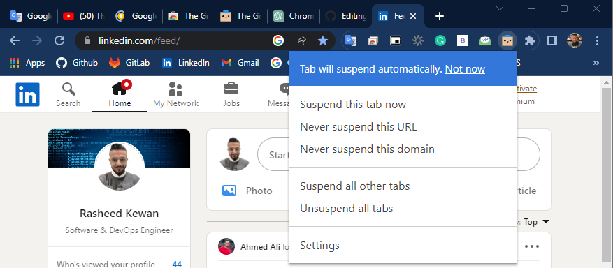

#
<h1 align="center">The Great Suspender Original Usage</h1>

 

### Opening multiple tabs in ***Google Chrome*** can cause several things:

* Increased memory usage: Each tab in Google Chrome runs as a separate process, and as you open more tabs, the memory usage on your computer can increase.

* Slowed performance: With more tabs open, your computer may slow down and become less responsive, especially if you have limited memory and processing power.

* Reduced battery life: More tabs in Google Chrome can consume more battery power, especially on laptops and mobile devices.

* Confusing navigation: With too many tabs open, it can become difficult to find and switch between the tabs you need, leading to a cluttered and confusing browsing experience.

Overall, opening multiple tabs in Google Chrome can impact the performance and stability of your computer and browsing experience, so it's important to manage your tabs effectively.

So to deal with this problem we aim to improve the performance and stability of your computer and browsing experience by adding a google chrome extension named "The Great Suspender Original" 

 

# Instructions
1. Google for the extension named `The Great Suspender Original`
2. Click `Add to Chrome` button.
3. Then : 

4. It will show you multiple suspend options to perform : 

